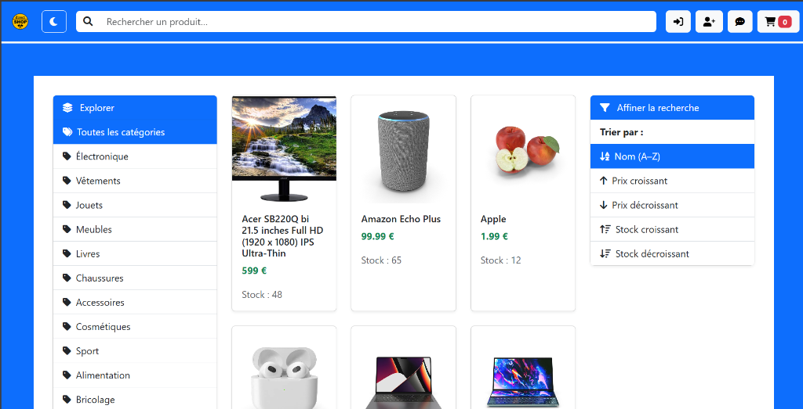
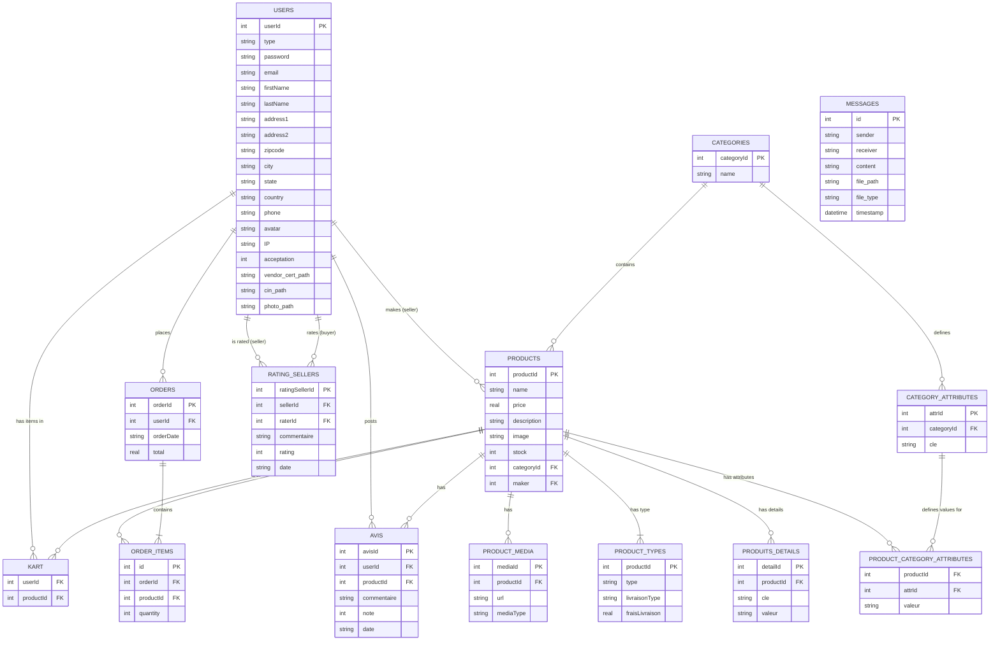

# DirectShop

DirectShop is an e-commerce platform that connects buyers and sellers. It features product management, shopping cart functionality, order processing, and user reviews.



## Class Diagram



## Running the Application

### Prequisites
- Python 3.x
- Flask
- SQLite3

### Installation

1. Install dependencies:
   ```bash
   pip install flask flask-cors
   ```

2. Run the application:
   ```bash
   python main.py
   ```

The application will start on `http://localhost:5000`.
